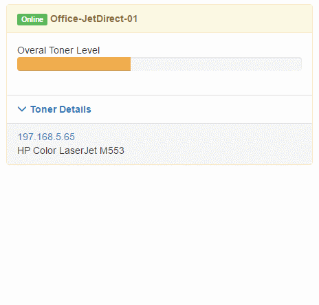

# Powershell + Firebase.io + Angular = Printer Dashboard. 

This is a hacky little project that I've been maintaining to keep my sanity while dealing with toner. I'm sure there are tools out there that can do this, but building the dashboard was part of the challange. Because of the synergys between AngularJS and FireBase, the dashboard is real time reactive, not that you need to ever look at your toner in real time.

# Requirements
* Windows Server 2012+ or Windows Desktop 8+
* Firebase Account
* Windows Print Server

# Instructions

There are a few things you need to do before this script will do its thing. Make sure you meet all the requirements above first before using. 
- head to firebase and set up a database (if you haven't already). When signed in to the console and selected your database, on the left hand side pick **database**. Then at the top next to **Data** click **Rules**. You can use these rules to change how people can auth to your DB. If you set `".read":` and `".write":` to `true` instead of their default you basically set public access. Read the docs about authentication to get a better sense of how to make the database more secure. I haven't done that part yet. 
- Then in the ps1 file edit a few lines.
    - Line 6, add your print server name
    - Line 7 add your Firebase URL
    - Line 13-14, add filter rules to pull the printers you want to track. 
- Then you need to update the js file inside of the dashboard folder. 
    - Line 8, add your firebase database url. 

That might be all you need to do. Once you run it, you should see it add entries to the firebase database. 
